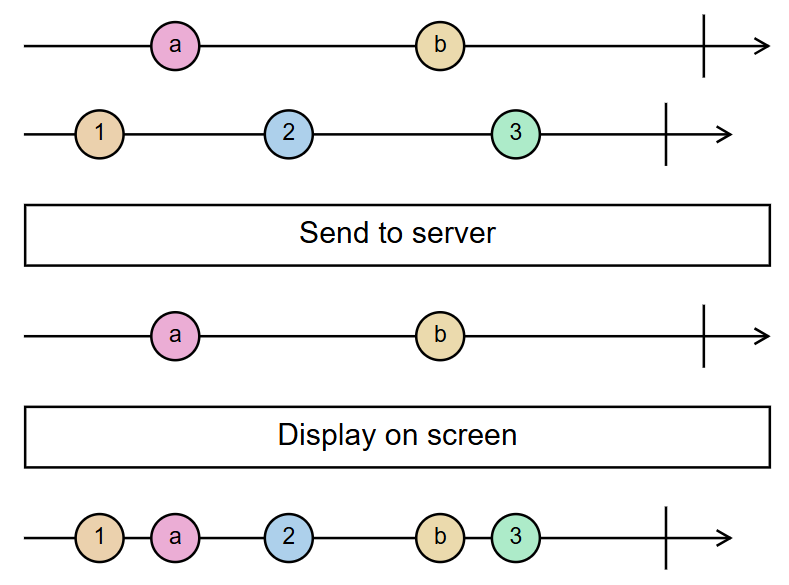
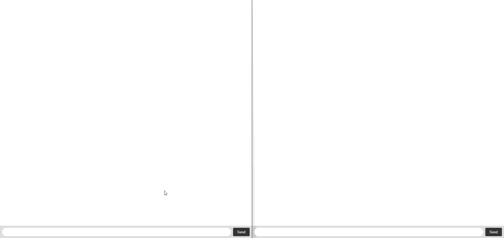

# Reactive Programming Demo

In this tutorial, we are going to build a basic messaging webapp utilizing Javascript's
reactive programming library [rxjs](https://github.com/ReactiveX/rxjs),
websockets using Socket.IO and asynchronous programming.

In the final app, users will be able to see their own messages and messages sent by others. In this basic version, only
the message's text, its timestamp, and whether it was sent or received will be visible. The focus of the demo is
incorporating reactive programming paradigms into a working chat app.

### Pre-requisites:

To run this tutorial, you will first need to install [Node.js](https://nodejs.org/en).
This is necessary to install the packages needed for this project, as well as to run the web server
that will transmit messages and allow the app to be viewed in your browser.

Once doing so, clone this repository to your computer, cd into the project and run `npm install`
to install the project's dependencies.

Then run `npm run dev` to start up the development server.

You should now be able to view a basic webpage in your browser at http://localhost:3006/.
If you are able to see a mostly blank page with a text box and a "Send" button at the bottom,
everything is working as expected!

Just a heads-up, this demo has a back-end (Node JS) and a front-end both written in [**TypeScript
**](https://www.typescriptlang.org/), which is a superset of JavaScript with static type checking. If you've never
worked with JavaScript or TypeScript, no worries! We'll provide you some syntax hints. You'll be surprised at how much
you're able to pick up.

#### Tech Stack

* **Express.JS** - the web server app that serves the HTML page to the browser
* **Socket.IO** - an abstraction over the standard web sockets, a real-time connection between a browser and a server
  application
* **tsc** (TypeScript compiler/transpiler) - converts strongly typed TypeScript code into JavaScript that can run on the
  server or in the browser
* **esbuild** - bundles
* ***RxJS*** - part of the ReactiveX series of reactive programming libraries in a variety of languages. This
  incorporates the reactive programming paradigm to your JavaScript code.

### Getting started:

There are a few files already created for you:

- `index.html` - This controls the content that you see in your browser.
  You won't need to make any changes to this file for this tutorial.
- `server/main.ts` - This file controls the web server that allows the
  site to run on your computer.
- `client/main.ts` - This file is currently empty, but it is the starting
  point for the functionality that we are going to be built out.
  Interactive and reactive functions will be placed here in the future.

There are a few other files related to some of the technologies mentioned above; however, we won't ask you to modify
them for this tutorial. Feel free to look into them to learn how these libraries work together.

As you work, run `npm run dev` to run the server locally. You can chat with yourself in different browser tabs!

### Handle a message being sent:

RxJs fills in the missing spot in this table with [`Observable`](https://rxjs.dev/api/index/class/Observable), which are
called "lazy push" collections.

|      | Single                                                                                                | Multiple                                                                                            |
|------|-------------------------------------------------------------------------------------------------------|-----------------------------------------------------------------------------------------------------|
| Pull | [`Function`](https://developer.mozilla.org/en-US/docs/Glossary/Function)                              | [`Iterator`](https://developer.mozilla.org/en-US/docs/Web/JavaScript/Reference/Iteration_protocols) |
| Push | [`Promise`](https://developer.mozilla.org/en-US/docs/Web/JavaScript/Reference/Global_Objects/Promise) | ???                                                                                                 |

Let's first add an event handler for when a user sends a message. Open `client/main.ts`

Add the following lines to the top of the file:

```typescript
import {fromEvent, map, tap, merge, shareReplay} from "rxjs";

const form = document.getElementById("form")!;
```

This creates a new variable, `form`, a reference to the HTML `<form>` element on the chat page where the user types a
chat message (
see `index.html`).
We can now use reactive programming to observe this form and build a collection of data
from every time a message is sent/the form is submitted.

In *imperative* JavaScript, we add *event listeners* to elements like this:

```typescript
form.addEventListener('submit', e => { /*e is the Event object, a parameter to this function*/
    /* Execute event handling code here in the body of this arrow function */
})
```

Just like in event driven Java code in Swing or Android for example, we set a code block to run when an event fires.

However, Reactive programming allows us to think about how data will flow from different parts of the application.
Reactive programming makes use of marble diagrams like this one to show how data flows.



The user's messages are `a` and `b`, and `1`, `2`, and `3` are received from other users. Notice how we want to send
only the user's messages to the server but we want to show all messages on the screen. We will also need to perform
other operations, for example, converting the form event to a rich `Message` object with all the info we need.

#### Creating an observable

RxJS has a built-in function for creating an `Observable` from a browser event,
called [`fromEvent`](https://rxjs.dev/api/index/function/fromEvent);

Add this code below the previous line:

```typescript
const userMessages$ = fromEvent<FormDataEvent>(form, 'submit');
```

`fromEvent` uses reactive programming to build an array of items from a series of events. Each time a specified event is
triggered (in this case a `FormDataEvent` on `form`), an event object is pushed to the collection.

Now, we'll use the `pipe` method on Observable to create our data pipeline. This allows us to
add [RxJS operators](https://rxjs.dev/guide/operators) to do our data transformations.

```typescript
myObservable$.pipe(
    operator1(...),
    operator2(...)
)
```

Run the app with `npm run dev`. First, if you click the submit button, notice it causes a navigation to the page. This
is the *default* behavior, which will be unhelpful for sending and receiving messages.

Our first operator, `tap(handler: (e: Event) => void)`, is used to perform a side effect without modifying the data—in
this
case we use it to prevent
the
browser-default form submission behavior. We can use `Event.preventDefault()` in the function argument to prevent this
default behavior.

Try using `tap(x => console.log(x))` for debugging purposes. As you work, check the browser console (<kbd>
CTRL</kbd>+<kbd>Shift</kbd>+<kbd>I</kbd> in most browsers, find the Console tab).

Now, we want to transform this form event into a useful format. The most common operator in ReactiveX is `map`, used for
this purpose. It takes a function that transforms data from one type to another.

```typescript
map(handler: (x: XType) => y: YType)
```

The only information we need from this form is the string value
of the `<input>` element. We can extract the value of the input with this logic:

```typescript
const messageInput: HTMLInputElement = ((e.currentTarget as HTMLFormElement).querySelector('input[name="message"]')!);
const message = messageInput.value;
messageInput.value = ""; /*Note: this is a side-effect!*/
return message;
```

Notice the side-effect in the above logic. In most cases, `map` uses pure functions and `tap` handles all side effects,
but in this case we need to clear the form and grab the value in the same step.

In the next operation, we want to add some additional context (time, action) to the message. We can transform the data
into a `Message` object (see types.d.ts).

```typescript
map((message: string): Message => {
    return {data: message, action: "sent", timestamp: new Date()};
}),
```

This takes the previous message string and stores it in a new message object that also contains
whether the message was sent or received, and when it was sent.
This will be useful later when displaying messages in the browser.

### Display messages in the browser (like & subscribe!)

Now that we have this data pipeline established, how can we actually do anything with the data? Part of the benefit of
reactive programming is that we decouple *gathering data* from *using data*.

We can subscribe to Observables to consume these collections. Subscribing to an observable **creates the collection**
and **handles all current and future updates**. In this case, it creates the event listener and passes all future events
through the pipeline and to a handler that we'll define now.

Let's add a basic subscription to `client/main.ts`:

```typescript
userMessages$.subscribe(message => {
    console.log("message", message)
});
```

When you run the app, notice that each message you type is sent to the console as a complex Message object!

This doesn't do much for us, though. We want to display the messages a user inputs into the browser, rather than just
having them disappear after they
are sent. This logic creates a new message HTML element. Let's add it to our subscription:

```typescript
const newMessage = document.createElement("li");
newMessage.innerHTML = `
    <div>
        <p class="message-text">${message.data}</p>
        <p class="message-date">${message.action} ${new Date(message.timestamp).toLocaleString()}</p>
    </div>
`;
newMessage.classList.add(message.action);
document.getElementById("messages")!.appendChild(newMessage);
```

In this case, every time a new message is sent, we want to immediately display it in the browser.
Reactive programming makes this action extremely seamless to achieve.

Refresh your browser, you should now be able to input a message and press send,
and it should display at the top of the screen!

However, if you open up this site in a second tab, you'll notice that messages are not passed between the two instances.
What kind of messaging app only lets you send messages to yourself?? (Well, our app, but with extra steps. Just trust
the process.)

### Set up a Websocket *(our second subscriber)*

Websockets are used to asynchronously send and receive data between one or more clients and a server.
This allows applications to react to events (such as sending a message) in real-time! It may be clear how the
asyncronous nature of websockets connects to reactive programming.

We have already set up a Websocket on the server side, now you just need to connect to it.
Create a new file in the `client` folder named `connection.ts`.
This will be responsible for all communication with the Websocket.

First, import the necessary libraries to communicate with the socket.

```typescript
import {Subject} from 'rxjs';
import {io} from 'socket.io-client';
```

Then open up a connection to the socket:

```typescript
export const socket = io();

socket.on('connect', () => {
    console.log('Connected to server');
});
```

Refresh your browser. If you can see `Connected to server` in the terminal, that means everything is working correctly!

We now want to have the Websocket transit a message when a user presses the "Send" button.
Let's add a new function to `connection.ts`:

```typescript
export const sendMessage = (message: Message) => {
    socket.emit('message', message);
};
```

Whenever this function is called with an instance of a `Message` object, that message object will be emitted by the
websocket to any
connected servers or clients.
Now let's call this function whenever a user sends a message. `export` allows us to import this function from another
module (like `main.ts` maybe?).

Back in `client/main.ts`, let's subscribe to `userMessages$` a second time (call `subscribe` again)! We should send all
of the user's messages to the websocket by importing the function we just made.

```typescript
userMessages$/*.... try finishing this code yourself!*/
```

This ensures that whenever a new message is added to userMessages, it will immediately be dispatched by the Websocket.

Throw in a `console.log(message)` to this second subscription. Now, **check the console logs** to see if both
subscriptions are working.

Is the second log blank? Based on what you know about how subscriptions work (see top of section), think about what might be going on.

<details>
  <summary>Expand for the solution!</summary>

  > The problem is that each subscriber is **creating a new listener**, which clears the input each time a value is submitted. Thus, the second subscriber gets an empty string when it tries to access the input's value!
  >
  > Many times, we want this behavior. However, in this case we want the subscribers to share the data that comes through the pipeline and only run the side effects once.
  >
  > Thankfully, RxJS provides an operator for that, `shareReplay()` (no arguments). Add that to the end of the pipe to share the data between subscribers. Just like Zendaya, let's put this song on replay!
</details>

<br/>

Reload your browser, and open the site in a second tab. You'll notice that, if you write a message in one,
it still does not appear in the other. That is because we need to actually handle messages the Websocket receives.

Let's add a Socket.IO event handler in `connection.ts`:

```typescript
socket.on('message', (message) => {
    console.log('Received message:', message);
    message.action = "received";
});
```

`socket.on('message', (message) => {...})` waits until the Websocket is sent a new message and then performs an action.
Currently, we just log it to the console, and set its action as "received".

There isn't a neat wrapper for a Socket.IO handler in an RxJS observable, so we'll have to add the data to an observable ourselves.

The problem is-- we can't wait until someone subscribes to our observable to create this Socket.IO handler. We need to create it synchronously right away. 

A Subject is a special type of Observable. Basic observables create their own connection to a data source, but we can send data to subjects from outside. This makes it perfect for receiving data from the Socket.IO handler. It's a subscription and an observable all in one!

```typescript
export const serverMessages$ = new Subject<Message>();
```

To send a new data to the Subject and its subscribers, RxJS provides the `next` function.

Add a line to the `socket.on('message')` handler calling it:

```typescript
socket.on('message', (message) => {
    console.log('Received message:', message);
    message.action = "received";
    serverMessages$.next(message as Message);
});
```

Notice how this transforms the message to show that it was received from an external user (on another tab)!

However, this still isn't enough to display these messages on screen -
we'll need to add some more code to `client/main.ts`.

Currently, we have two different Observables: `userMessages$` and `serverMessages$`. However, we want the interface to
display all of these messages together indiscriminately. RxJS provides the `merge` function for this case - taking two
different
observables and combining them into one!

```typescript
const messages$ = merge(userMessages$, serverMessages$);
```

You'll need to import `serverMessages$` from `connection.ts`:

```typescript
import {serverMessages$, sendMessage} from "./connection";
```

Finally, change the `userMessages$.subscribe` function to instead subscribe to `messages$` -
we want to update the UI as soon as **either** a message is sent or received.

```typescript
messages$.subscribe(message => {
    console.log("message", message)
    const newMessage = document.createElement("li");
    newMessage.innerHTML = `
        <div>
            <p class="message-text">${message.data}</p>
            <p class="message-date">${message.action} ${new Date(message.timestamp).toLocaleString()}</p>
        </div>
    `;
    newMessage.classList.add(message.action);
    document.getElementById("messages")!.appendChild(newMessage);
});
```

Refresh your browser one more time.
You should now be able to send messages back and forth between two different browser
tabs!

